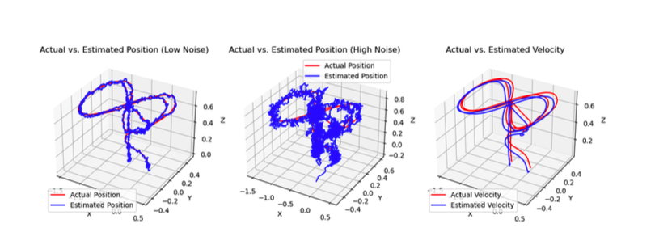

# Kalman Filter for Robot Navigation

A Python implementation of the Kalman Filter algorithm for state estimation in robot navigation, specifically designed for tracking position and velocity of a 27-gram object using noisy sensor data.

## Overview

This project implements a 6-state Kalman Filter to estimate the position and velocity of a small object (27 grams) in 3D space. The filter processes noisy sensor measurements and provides optimal state estimates by combining predictions with measurements using the Kalman Filter algorithm.

## Features

- **6-State Kalman Filter**: Tracks 3D position and velocity (x, y, z coordinates)
- **Multiple Data Scenarios**: Supports low noise, high noise, and velocity tracking modes
- **Flexible Measurement Models**: Can track either position or velocity measurements
- **3D Visualization**: Interactive 3D plots comparing actual vs. estimated trajectories
- **Real Data Processing**: Works with actual sensor data from motion capture systems

## Project Structure

```
├── kalmanfilter.py                    # Main Kalman Filter implementation
├── kalman_filter_data_low_noise.txt  # Low noise sensor data
├── kalman_filter_data_high_noise.txt # High noise sensor data
├── kalman_filter_data_velocity.txt   # Velocity measurement data
├── kalman_filter_data_mocap.txt      # Ground truth motion capture data
├── RBE595_Kalman_Filter_Assignment.pdf # Assignment documentation
├── Project 2 - Kalman Filter.pdf     # Project specification
├── LICENSE                           # MIT License
└── README.md                         # This file
```

## Data Format

The sensor data files contain comma-separated values with the following structure:
- Column 0: Timestamp
- Columns 1-3: Force measurements (Fx, Fy, Fz)
- Columns 4-6: Position measurements (x, y, z)

The motion capture data (`kalman_filter_data_mocap.txt`) provides ground truth positions for comparison.

## Installation

### Prerequisites

- Python 3.6 or higher
- NumPy
- Matplotlib

### Setup

1. Clone the repository:
```bash
git clone <repository-url>
cd Kalman-Filter
```

2. Install required dependencies:
```bash
pip install numpy matplotlib
```

## Usage

### Basic Usage

Run the main script to execute all three scenarios:

```bash
python kalmanfilter.py
```

This will:
1. Process low noise data with position tracking
2. Process high noise data with position tracking  
3. Process velocity data with velocity tracking
4. Display 3D visualization comparing actual vs. estimated trajectories

### Custom Usage

You can also use the KalmanFilter class directly:

```python
from kalmanfilter import KalmanFilter

# Low noise position tracking
kalman = KalmanFilter(type=1, position=True)
estimated_positions = kalman.Kalmanloop()

# High noise position tracking
kalman = KalmanFilter(type=2, position=True)
estimated_positions = kalman.Kalmanloop()

# Velocity tracking
kalman = KalmanFilter(type=3, position=False)
estimated_velocities = kalman.Kalmanloop()
```

### Parameters

- `type`: Data type selection
  - `1`: Low noise data
  - `2`: High noise data
  - `3`: Velocity data
- `position`: Measurement type
  - `True`: Position measurements
  - `False`: Velocity measurements

## Algorithm Details

### State Vector
The 6-state vector includes:
- Position: [x, y, z]
- Velocity: [vx, vy, vz]

### State Transition Model
```
x[k+1] = A*x[k] + B*u[k] + w[k]
```
Where:
- `A`: State transition matrix
- `B`: Control input matrix
- `u[k]`: Force input (from sensor data)
- `w[k]`: Process noise

### Measurement Model
```
z[k] = H*x[k] + v[k]
```
Where:
- `H`: Measurement matrix (position or velocity)
- `v[k]`: Measurement noise

### Kalman Filter Steps

1. **Prediction**:
   - Predict state: `x̂[k|k-1] = A*x̂[k-1] + B*u[k-1]`
   - Predict covariance: `P[k|k-1] = A*P[k-1]*A^T + Q`

2. **Update**:
   - Innovation: `y[k] = z[k] - H*x̂[k|k-1]`
   - Innovation covariance: `S[k] = H*P[k|k-1]*H^T + R`
   - Kalman gain: `K[k] = P[k|k-1]*H^T*S[k]^-1`
   - Updated state: `x̂[k] = x̂[k|k-1] + K[k]*y[k]`
   - Updated covariance: `P[k] = (I - K[k]*H)*P[k|k-1]`

## Configuration

### Noise Parameters
- **Process noise standard deviation**: 0.0001
- **Measurement noise (position)**: 0.1
- **Measurement noise (velocity)**: 0.05
- **Initial covariance**: 1e-6 (identity matrix)

### Physical Parameters
- **Object mass**: 0.027 kg (27 grams)

## Results

The implementation provides:
- Real-time state estimation for 3D position and velocity
- Comparison between actual (motion capture) and estimated trajectories
- Performance analysis across different noise levels
- 3D visualization of tracking results

## Visualization

The script generates a 3D plot with three subplots:
1. Low noise position tracking results
2. High noise position tracking results  
3. Velocity tracking results

Each subplot shows:
- Red line: Actual trajectory (ground truth)
- Blue line: Estimated trajectory (Kalman filter output)



*Figure: 3D visualization comparing actual vs. estimated trajectories for different noise scenarios and measurement types.*

## Academic Context

This project was developed as part of RBE595 (Advanced Robot Navigation) coursework, focusing on:
- State estimation theory
- Kalman filter implementation
- Sensor fusion techniques
- Robot navigation applications

## License

This project is licensed under the MIT License - see the [LICENSE](LICENSE) file for details.

## Author

**Rohin Siddhartha**  
Copyright (c) 2025

## Contributing

Contributions are welcome! Please feel free to submit a Pull Request.

## References

- Kalman, R. E. (1960). "A new approach to linear filtering and prediction problems"
- Bar-Shalom, Y., Li, X. R., & Kirubarajan, T. (2001). "Estimation with applications to tracking and navigation"